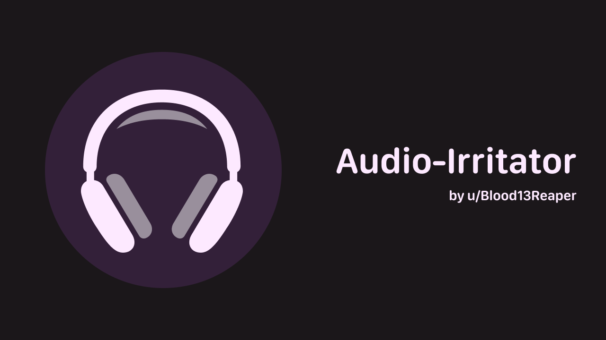

# 🌓 Audio Irritator

**A minimal, full-screen PWA timer that plays randomized audio bursts to ethically disrupt sleep or enhance alertness. Built with a native iOS aesthetic and deep customization.**

> ⚡ Final Release · 🌙 Dark Mode First · 📲 PWA Installable on iOS & Android

---

## 🎯 Features

- ⏱️ Set max interval & duration with precision
- 🔊 Real-time volume slider & pitch control
- 🔁 Randomized burst playback
- 🎛️ Minimal stepper UI with long-press support
- 📱 Installable PWA — works offline
- 💠 Feels native on iOS and Android
- 🌗 System theme aware (dark/light mode)

---

## 🔗 Launch App

👉 **[Open Audio Irritator in your browser](https://thilac13.github.io/Audio-Irritator/index.html)**  
_(Best viewed in Safari or Chrome on mobile)_

---

## 📲 Installation Guide

### iOS (iPhone/iPad)
1. Open the app in **Safari**.
2. Tap the **Share** icon (bottom center).
3. Select **"Add to Home Screen"**.
4. Done — it launches like a native app with splash screen and icon!

> ✅ Works in fullscreen mode with no address bar.  
> 💡 Tip: Add in dark mode for best visuals.

---

### Android (Chrome)
1. Open the app in **Chrome**.
2. Wait a few seconds, or tap the **menu (⋮)**.
3. Select **"Add to Home Screen"**.
4. Confirm installation.

> 🚀 The app runs offline after install. No Play Store needed!

---

## 📸 Preview

> _(Here’s how the app looks when installed and running in standalone mode)_

---

## 🛠 Tech Stack

- HTML5, CSS3, JavaScript
- Vanilla JS (no frameworks)
- PWA APIs (Service Worker + Manifest)
- Designed in Figma
- iOS-style UI/UX manually styled

---

## 💬 Feedback Welcome

This is the **final release**, but I’m actively listening to user feedback.  
Have a suggestion or idea? Reach out and I may implement it in future updates!

📩 Reddit: [u/Blood13Reaper](https://www.reddit.com/u/Blood13Reaper/)

---

## 📄 License

### MIT License

This project is licensed under the MIT License.  
You are free to use, modify, and distribute with attribution.

> TL;DR: Do whatever you want, but don’t sue the author.

---

## 🙌 Acknowledgements

- Inspired by personal sleep disruption needs
- Special thanks to friends who helped test and give feedback

---

_Designed with ❤️ in Figma & hand-coded for iOS and Android_  
🧪 Try it → [Audio Irritator](https://thilac13.github.io/Audio-Irritator/index.html)
